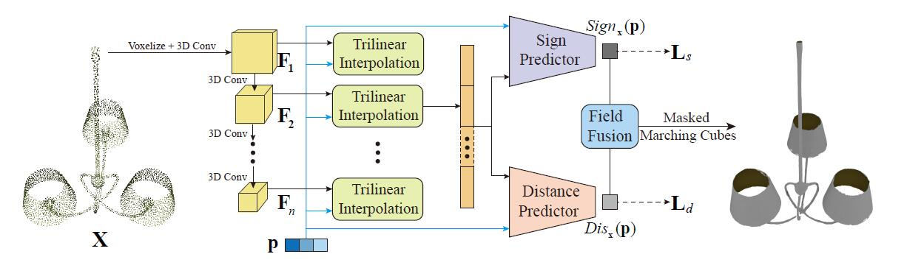

# HSDF (Jittor): Hybrid Sign and Distance Field for Modeling Surfaces with Arbitrary Topologies

[Paper](https://openreview.net/forum?id=Soadfc-JMeX) - 
[Project Website](http://geometrylearning.com/hsdf/) -
Published in NeurIPS 2022.

## Introduction
This repository is code release for HSDF: Hybrid Sign and Distance Field for Modeling Surfaces with Arbitrary Topologies.



Recent advances in neural implicit representation have set a new state of the art in 3D modeling and reconstruction by breaking the previous barrier in resolution and topology. However, as such approaches rely on the signed distance function (SDF) which divides the space into inside and outside of the object, they are limited to representing closed shapes. To lift the limitation, methods based on unsigned distance function (UDF) are proposed such that a much broader class of shapes containing open surfaces can be effectively represented and learned via deep neural networks. 
However, as UDF is signless, directly applying the iso-surface extracting technique, e.g. the Marching Cubes algorithm, would convert all open surfaces into the closed mesh. To generate open structures, these approaches have to convert the resulting UDF field into discrete points and then apply the Ball-Pivoting algorithm (BPA) to obtain the meshing result. Nonetheless, the BPA technique is prone to introduce self-intersections and disconnected surface patches with inconsistent normals. In addition, BPA is highly sensitive to the input parameters and often requires per-shape parameter tuning in order to generate a complete meshing result. This hinders UDF-based approaches from being practically used in real-world applications as mesh remains the prominent standard for modeling and rendering in both industry and academia. 
To address the above issue, we present a novel learnable implicit representation, named Hybrid Sign and Distance Function (HSDF), that can faithfully represent complex geometry containing both closed and open surfaces, while being compatible with off-the-shelf iso-surface extraction methods, e.g. the Marching Cubes algorithm, for easy and high-quality field-to-mesh conversion. The key idea of HSDF is to integrate the advantages of both SDF and UDF while avoiding their adversarial impacts. We empirically find that the learning of UDF is quite robust and can generalize well to novel data. Therefore, to inherit the benefit of UDF and overcome its limitation, we propose to learn an additional sign field in addition to UDF via a sign predictor. Unlike traditional SDF, HSDF is able to locate the surface of interest before performing level surface extraction. We achieve this by generating surface points via the gradient field of the unsigned distance function following NDF. Hence, we are able to create local SDFs by multiplying the UDF with the sign field and cast complex shapes containing both closed and open surfaces by incorporating an adaptive meshing algorithm that only instantiates the regions containing surface points into a polygon mesh.

## Installation

The code is tested with Ubuntu 18.04, Python 3.8.12 Jittor 1.3.5.21, CUDA 11.1 and cuDNN 8005.

Set Up Environment

    install anaconda and Run 'conda env create -f environment.yml' to build a environment and 'conda activate HSDF_env' to activate it

    
For the jittor installation, please refer to [this link](https://cg.cs.tsinghua.edu.cn/jittor/download).


## Experiment Preparation

First, create a configuration file in folder `configs/`, use `configs/example*.txt` as reference and see  `configs/config_loader.py` for detailed explanation of all configuration options.

Next, download the MGN data from official website https://datasets.d2.mpi-inf.mpg.de/MultiGarmentNetwork/Multi-Garmentdataset.zip
    
Next, prepare the data for HSDF using
```
python dataprocessing/preprocess.py --config configs/example.txt
```

and generate a random test/training/validation split of the data using
```
python dataprocessing/create_split.py --config configs/example.txt
```

but replacing `configs/example.txt` in the commands with the desired configuration.

> Note: The preprocessing with `dataprocessing/preprocess.py` can be time intensive. In case multiple compute machines are 
> available, the script can be run in parralell on those machines by splitting the overall files to preprocess into 
> chuncks. For this, use: \
> `python dataprocessing/preprocess.py --num_chunks X --current_chunk Y` \
> where X is the desired number of chunks (e.g. the number of availiable machines) and Y is the chunk to be processed 
> with execution of this command. Y needs to be an integer between 0 to X-1, including O and X-1. In case you have SLURM
> available you can adapt `slurm_scripts/run_preprocessing.sh` and use it via
> ```
> sbatch slurm_scripts/run_preprocessing.sh
> ```
  
## Training 
    
    Train model 'python train.py --config ./configs/example.txt
    
## Generate model
    
    Download pretrained models from [this link](https://mailsucaseducn-my.sharepoint.com/:u:/g/personal/yangjie161_mails_ucas_edu_cn/Ee6jnWgGLrpOru32pOSOHQoBRTHBfSnnB5KoPkrgtuBW3Q?e=u6LqZd).
    Run 'python generate.py --config ./configs/example.txt'

If you prefer Pytorch version, please switch to [this](https://github.com/IGLICT/HSDF-Net/tree/pytorch).

## Citation

If you find our work useful in your research, please consider citing:

    @inproceedings{Wang22HSDF,
        author = {Wang, Li and Yang, Jie and Chen, Wei-Kai and Meng, Xiao-Xu and Yang, Bo and Li, Jin-Tao and Gao, Lin},
        title = {HSDF: Hybrid Sign and Distance Field for Modeling Surfaces with Arbitrary Topologies },
        booktitle={Neural Information Processing Systems (NeurIPS)},
        year = {2022},
    }
    
    @article{hu2020jittor,
      title={Jittor: a novel deep learning framework with meta-operators and unified graph execution},
      author={Hu, Shi-Min and Liang, Dun and Yang, Guo-Ye and Yang, Guo-Wei and Zhou, Wen-Yang},
      journal={Science China Information Sciences},
      volume={63},
      number={222103},
      pages={1--21},
      year={2020}
    }
