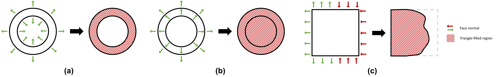

# TetWild - Tetrahedral Meshing in the Wild

Yixin Hu, Qingnan Zhou, Xifeng Gao, Alec Jacobson, Denis Zorin, Daniele Panozzo.
ACM Transactions on Graphics (SIGGRAPH 2018).

```
@article{Hu:2018:TMW:3197517.3201353,
 author = {Hu, Yixin and Zhou, Qingnan and Gao, Xifeng and Jacobson, Alec and Zorin, Denis and Panozzo, Daniele},
 title = {Tetrahedral Meshing in the Wild},
 journal = {ACM Trans. Graph.},
 issue_date = {August 2018},
 volume = {37},
 number = {4},
 month = jul,
 year = {2018},
 issn = {0730-0301},
 pages = {60:1--60:14},
 articleno = {60},
 numpages = {14},
 url = {http://doi.acm.org/10.1145/3197517.3201353},
 doi = {10.1145/3197517.3201353},
 acmid = {3201353},
 publisher = {ACM},
 address = {New York, NY, USA},
 keywords = {mesh generation, robust geometry processing, tetrahedral meshing},
} 
```

## News

🎉🎉🎉 We have 2D version "TetWild" - **TriWild** public! TriWild is able to deal with both linear and curved constraints. Now we are able to mesh curves robustly! Check it out 👉 **[TriWild](https://github.com/wildmeshing/TriWild)**.

## Important Tips

💡💡💡 **If you are interested in the algorithm details, please refer to our [paper](https://cs.nyu.edu/~yixinhu/tetwild.pdf) first. We provide plenty of examples and statistics in the paper. You can also refer to my SIGRRAPH talk [slides](https://slides.games-cn.org/pdf/GAMES201858%E8%83%A1%E8%AF%91%E5%BF%83.pdf).**

💡💡💡 **Check our [license](https://github.com/Yixin-Hu/TetWild#license) first.**

💡💡💡 **Our algorithm should be and is robust both in theory and in practice. If you do find TetWild crash (on your laptop), please test it (on cluster) with more resource given. The most complex model I tested requires >100GB memory.**

💡💡💡 **The orientation of input faces is as important as the position of their vertices. Our algorithm is faithful to the input face position and orientation. The winding number algorithm we are using requires reasonably consistent orientation of the input triangle mesh. If the input has a large region of faces all inverted (i.e. with flipped normal), the output tetmesh could have some parts missing or includes some elements "outside" the surface around this region, which is expected because the inverted input faces defines the "inside" as outside. We provide three 2D examples as below for easier understanding. The left in each sub-figure is input boundary with normals and the right is output triangle meshes.**



<!-- New features-->

## Dataset
Here is pre-generated tetmeshes and the extracted surface meshes for research-purpose usage. **Please kindly cite our paper when using our pre-generated data.**

- Input: [Thingi10k](https://ten-thousand-models.appspot.com/)

- Output:
[10k tetmeshes](https://drive.google.com/file/d/17AZwaQaj_nxdCIUpiGFCQ7_khNQxfG4Y/view?usp=sharing),
[10k surface meshes](https://drive.google.com/open?id=1E_C1uVoG1ZGF3pfDpHFKIS8Qqd2VXLZQ)

- Figures in the paper: [Input/output & scripts](https://drive.google.com/file/d/1P4wFOGOEebNp4pT-s4sFhl9GTSQcG0n_/view?usp=sharing)

## Installation

#### via Docker

Install [Docker](https://docs.docker.com/) and run Docker. Pull TetWild Docker image and run the binary:

```bash
docker pull yixinhu/tetwild
docker run --rm -v "$(pwd)":/data yixinhu/tetwild [TetWild arguments]
```

Important note: If you find TetWild termination unreasonably, it's largely due to the momery limit of Docker. Please check the momery limit using `docker stats`.

#### via CMake

Our code was originally developed on MacOS and has been tested on Linux and Windows. We provide the commands for installing TetWild in MacOS:

- Clone the repository into your local machine:

```bash
git clone https://github.com/Yixin-Hu/TetWild
```

- Compile the code using cmake (default in Release mode):

```bash
cd TetWild
mkdir build
cd build
cmake ..
make
```

You may need to install `gmp` and `mpfr` or `CGAL` before compiling the code. You can install them via [homebrew](https://brew.sh/).

```
brew install gmp
brew install mpfr
```
or

```
brew install cgal
```

- Check the installation:

```bash
./TetWild --help
```
This command should show a list of TetWild parameters.

💡 If you do not have Boost installed (Boost-thread is needed for the logger spdlog), you can enable the cmake option `-DTETWILD_WITH_HUNTER=ON`. This will let CMake use [Hunter](https://github.com/ruslo/hunter) to download and configure Boost automatically. 

💡 If you find `Could not find Matlab` or `Could not find Mosek` in the output of cmake, it does not matter since they are not used.

💡 We provide users an option to use [ISPC](https://ispc.github.io/index.html) for computing energy parallelly. It reduces the timimg for computing energy to 50% of the original, but it could result in more optimization iterations and more overall running time. According to our experiment on 1000 models, it reduces the overall running time by 4% in average. If you want to use ISPC, please [install it first](https://ispc.github.io/ispc.html#installing-ispc) and then turn on the flag `GTET_ISPC` in `CMakeLists.txt`.

## Usage

### Input/output Format

The inputs of our software are triangle surface meshes in `.off/.obj/.stl/.ply` format.

We support `.mesh/.msh` format output. The default output format is `.msh` with minimum dihedral angle recorded as element scalar field, which can be visualized by software [Gmsh](http://gmsh.info/). You can use `PyMesh::MshLoader` and `PyMesh::MshSaver` in `pymesh/` for read and write `.msh` meshes.

💡 TetWild also outputs the surface of tetmesh in `.obj` format if the `is_quiet` flag is not turned on.

### Features
Our software is quite easy to use. Basically, users only need to provide a surface triangle mesh as input and our mesher would output a tetrahedral mesh by using default settings. If you want to customize your own tetmeshes, we also provide some options.

- Envelope of size *epsilon*

Using smaller envelope preserves features better but also takes longer time. The default value of *epsilon* is *b/1000*, where *b* is the length of the diagonal of the bounding box.

- Ideal edge length

Using smaller ideal edge length gives a denser mesh but also takes longer time. The default ideal edge length is *b/20*

- Filtering energy

Our mesher stops optimizing the mesh when maximum energy is smaller than filtering energy. Thus, larger filtering energy means less optimization and sooner stopping. If you do not care about quality, then give a larger filtering energy would let you get the result earlier. The energy we used here is conformal AMIPS whose range is from 3 to +inf. The default filtering energy is 10.

💡 We suggest not to set filtering energy smaller than 8 for complex input.

- Maximum number of optimization passes

Our mesher stops optimizing the mesh when the maximum number of passes is reached. The default number is 80.

- Targeted number of vertices

We allow users to input the targeted number of vertices and the mesher would try its best to match that number with 5% error. When the targeted number of vertices is unrealistically small, then the output tetmesh may not have number of vertices matched.

💡 If you want a tetmesh with low resolution, please use larger envelop and larger ideal edge length.

- Sizing field

Users can provide a background tetmesh in .msh format with vertex scalar field `values` stored. The scalar field `values` is used for controlling edge length. The scalars inside an element of the background mesh are linearly interpolated.

💡 [Here](https://drive.google.com/open?id=1-5AyoQ-CdZnX8IAqZoqgW1tiNBTNvFjJ) is an example including input surface mesh, background mesh and output tetmeshes with/without sizing control.

- Smoothing open regions

Our method can fill gaps and holes but the tetmesh faces on those parts could be bumpy. We provide users an option to do Lapacian smoothing on those faces to get a smoother surface.

- With out winding number

Please use `--save-mid-result 2`.

### Command Line Switches
Our software supports usage via command line or via a C++ function wrapper. Here is an overview of all command line switches:

```
RobustTetMeshing
Usage: ./TetWild [OPTIONS] input [output]

Positionals:
  input TEXT REQUIRED         Input surface mesh INPUT in .off/.obj/.stl/.ply format. (string, required)
  output TEXT                 Output tetmesh OUTPUT in .msh format. (string, optional, default: input_file+postfix+'.msh')

Options:
  -h,--help                   Print this help message and exit
  --input TEXT REQUIRED       Input surface mesh INPUT in .off/.obj/.stl/.ply format. (string, required)
  --output TEXT               Output tetmesh OUTPUT in .msh or .mesh format. (string, optional, default: input_file+postfix+'.msh')
  --postfix TEXT              Postfix P for output files. (string, optional, default: '_')
  -l,--ideal-edge-length FLOAT
                              ideal_edge_length = diag_of_bbox * L. (double, optional, default: 0.05)
  -e,--epsilon FLOAT          epsilon = diag_of_bbox * EPS. (double, optional, default: 1e-3)
  --stage INT                 Run pipeline in stage STAGE. (integer, optional, default: 1)
  --filter-energy FLOAT       Stop mesh improvement when the maximum energy is smaller than ENERGY. (double, optional, default: 10)
  --max-pass INT              Do PASS mesh improvement passes in maximum. (integer, optional, default: 80)
  --is-laplacian              Do Laplacian smoothing for the surface of output on the holes of input (optional)
  --targeted-num-v INT        Output tetmesh that contains TV vertices. (integer, optional, tolerance: 5%)
  --bg-mesh TEXT              Background tetmesh BGMESH in .msh format for applying sizing field. (string, optional)
  --save-mid-result           0: save result before optimization, 1: save mid-results during optimization, 2: save result without winding number.
  -q,--is-quiet               Mute console output. (optional)
  --log TEXT                  Log info to given file.
  --level INT                 Log level (0 = most verbose, 6 = off).
```

<!--### Tips
TODO :)-->

### Function Wrapper

💡 We use [libigl](https://github.com/libigl/libigl) to read the input triangle mesh. If you encounter any issue loading your mesh with libigl, please open a ticket there. Alternatively, you could load the mesh yourself and use our function wrapper to pass the raw data directly to TetWild.

We provide a wrapper for TetWild in `tetwild.h`, allowing users do the tetrahedaliztion without read/write data from/to files. One can use it in the following way:

1. Include the header file `#include <tetwild/tetwild.h>`.
2. Set parameters through a struct variable `tetwild::Args args`. The following table provides the correspondence between parameters and command line switches.

	| Switch              | Parameter                   |
	|:--------------------|:----------------------------|
	| --input             | N/A                         |
	| --postfix           | `args.postfix`              |
	| --output            | N/A                         |
	| --ideal-edge-length | `args.initial_edge_len_rel` |
	| --epsilon           | `args.eps_rel`              |
	| --stage             | `args.stage`                |
	| --filter-energy     | `args.filter_energy_thres`  |
	| --max-pass          | `args.max_num_passes`       |
	| --is-quiet          | `args.is_quiet`             |
	| --targeted-num-v    | `args.target_num_vertices`  |
	| --bg-mesh           | `args.background_mesh`      |
	| --is-laplacian      | `args.smooth_open_boundary` |

3. Call function `tetwild::tetrahedralization(v_in, f_in, v_out, t_out, a_out, args)`. The input/output arguments are described in the function docstring, and use libigl-style matrices for representing a mesh.

## License
TetWild is MPL2 licensed. But it contains CGAL code under GPL license. 

TetWild is free for both commercial and non-commercial usage. However, you have to cite our work in your paper or put a reference of TetWild in your software. Whenever you fix bugs or make some improvement of TetWild, you should contribute back.

## Acknowledgements

We used several useful libraries in our implement, testing, and rendering listed as follows. We would like to especially thank their authors for their great work and publishing the code.

- [PyMesh](https://github.com/qnzhou/PyMesh)
- [PyRenderer](https://github.com/qnzhou/PyRenderer)
- [CLI11](https://github.com/CLIUtils/CLI11)
