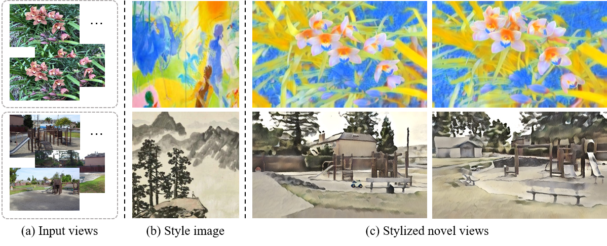

# StylizedNeRF (Jittor): Consistent 3D Scene Stylization as Stylized NeRF via 2D-3D mutual learning

## Introduction
This repository is code release for StylizedNeRF: Consistent 3D Scene Stylization as Stylized NeRF via 2D-3D mutual learning.

3D scene stylization aims at generating stylized images of the scene from arbitrary novel views following a given set of style examples, while ensuring consistency when rendered from different views. Directly applying methods for image or video stylization to 3D scenes cannot achieve such consistency. Thanks to recently proposed neural radiance fields (NeRF), we are able to represent a 3D scene in a consistent way. Consistent 3D scene stylization can be effectively achieved by stylizing the corresponding NeRF. However, there is a significant domain gap between style examples which are 2D images and NeRF which is an implicit volumetric representation. To address this problem, we propose a novel mutual learning framework for 3D scene stylization that combines a 2D image stylization network and NeRF to fuse the stylization ability of 2D stylization network with the 3D consistency of NeRF. We first pre-train a standard NeRF of the 3D scene to be stylized and replace its color prediction module with a style network to obtain a stylized NeRF. It is followed by distilling the prior knowledge of spatial consistency from NeRF to the 2D stylization network through an introduced consistency loss. We also introduce a mimic loss to supervise the mutual learning of the NeRF style module and fine-tune the 2D stylization decoder. In order to further make our model handle ambiguities of 2D stylization results, we introduce learnable latent codes that obey the probability distributions conditioned on the style. They are attached to training samples as conditional inputs to better learn the style module in our novel stylized NeRF. Experimental results demonstrate that our method is superior to existing approaches in both visual quality and long-range consistency.

## Installation

The code is tested with Ubuntu 18.04, Python 3.8, Jittor 1.2.2.58, CUDA 10.0 and cuDNN v7.5.

Set Up Environment

    [1] Run 'virtualenv stylenerf -p python3.7' to build a environment and 'source ./stylenerf/bin/activate' to activate it
    [2] Run 'pip install -r requirements.txt' to install libraries (Notice that pytorch3d should be of version 0.4.0 !!!)
    
For the jittor installation, please refer to [this link](https://cg.cs.tsinghua.edu.cn/jittor/download).

## Data preprocessing

    [1] Download the llff example data from official website http://cseweb.ucsd.edu/~viscomp/projects/LF/papers/ECCV20/nerf/nerf_example_data.zip
    [2] Prepare style images in ./style for stylized NeRF training and ./all_styles for VAE
  
## Pre-trained Model Preparation
    
    [1] Download the checkpoints of the VGG to ./pretrained
    [2] Train the decoder of AdaIN from scratch by running 'python train_style_modules.py --task finetune_decoder' or put the existing checkpoints of the decoder of AdaIN to ./pretrained
    [3] Run 'python train_style_modules.py --task vae' to pre-train the VAE
    
## Train and Evaluate a Stylized NeRF
    [1] Run 'python run_stylenerf.py --config ./configs/fern.txt' to train our model
    [2] Run 'python run_stylenerf.py --config ./configs/fern.txt --render_train_style --chunk 512' to check the outputs of the traning views
    [3] Run 'python run_stylenerf.py --config ./configs/fern.txt --render_valid_style --chunk 512' to check the outputs of the novel views

## Citation

If you find our work useful in your research, please consider citing:

    @inproceedings{Huang22StylizedNeRF,
        author = {Huang, Yi-Hua and He, Yue and Yuan, Yu-Jie and Lai, Yu-Kun and Gao, Lin},
        title = {StylizedNeRF: Consistent 3D Scene Stylization as Stylized NeRF via 2D-3D Mutual Learning },
        booktitle={Computer Vision and Pattern Recognition (CVPR)},
        year = {2022},
    }
    
    @article{hu2020jittor,
      title={Jittor: a novel deep learning framework with meta-operators and unified graph execution},
      author={Hu, Shi-Min and Liang, Dun and Yang, Guo-Ye and Yang, Guo-Wei and Zhou, Wen-Yang},
      journal={Science China Information Sciences},
      volume={63},
      number={222103},
      pages={1--21},
      year={2020}
    }
