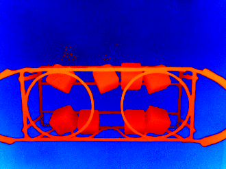
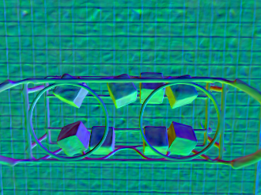
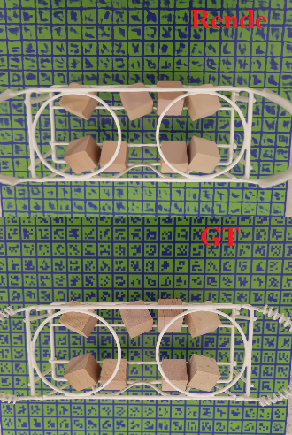
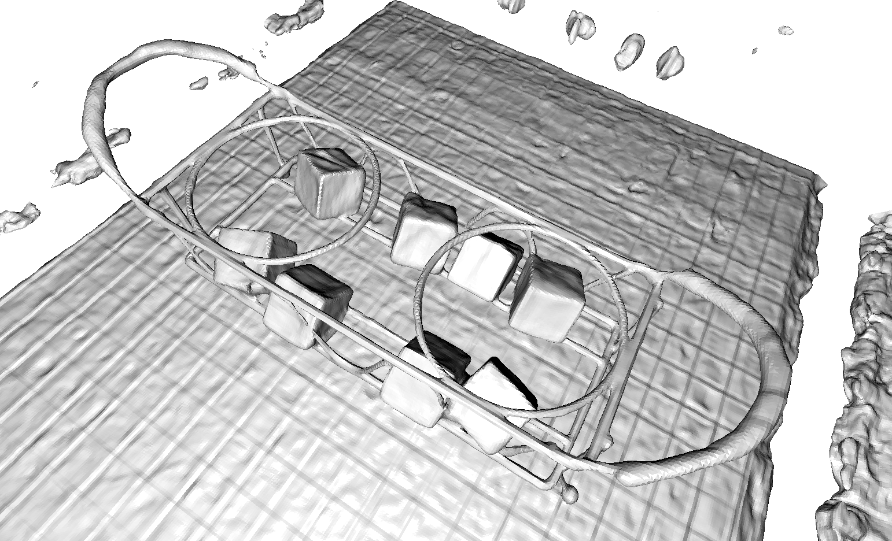

# Prepare dataset

Download the dataset from https://github.com/Totoro97/NeuS and extract it.


# Set the project file

Update path in `JNeRF/projects/neus/configs/neus_womask.py`

```

...

# Line 11-16
dataset = dict(
type = 'NeuSDataset',
# set dataset dir to the path where the dataset is extracted
dataset_dir = '/data/yqs/mesh_recon/NeuS_jittor/data_thin_structure/thin_cube',
render_cameras_name = 'cameras_sphere.npz',
object_cameras_name = 'cameras_sphere.npz',
)

...

# Line 90
# set base_exp_dir to the path where you want to save the results
base_exp_dir = './log/thin_cube/womask'

...

```


# Train

Use the following command to train the network.
```
python tools/run_net.py --config-file ./projects/neus/configs/neus_womask.py --type mesh --task train
```

During training, the network will output `depth`, `normal`, `RGB`, and `mesh`. However, the quality of the mesh is lower at this point to speed up training.





# Extract mesh

After finishing training the network, you can use the following command to extract the high quality mesh, and the mesh is saved in the results folder ( eg. `./log/thin_cube/womask/mesh` ).
```
python tools/run_net.py --config-file ./projects/neus/configs/neus_womask.py --type mesh --task validate_mesh
```



# More

For more details, please check https://github.com/Totoro97/NeuS.
